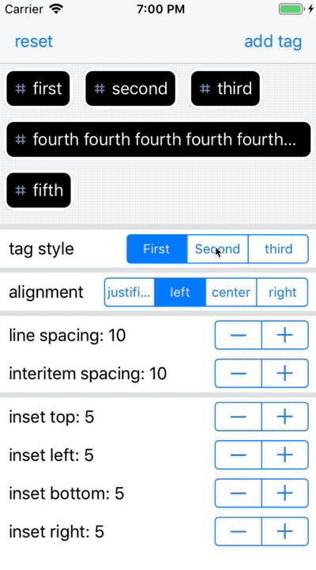

 

  

 
<H1 align="center">Awesome Pods</H1>

# `iOS-awesome-pods`
## This project is aiming to list the most needed and awesome pods lib for iOS projects

https://github.com/SwiftCairo/MeetupSessions/tree/master/13th%20meetup/Architecture%20Homicide
https://medium.com/swiftblade/using-swift-concurrency-with-coordinator-pattern-de290b95f09b
https://github.com/ProxymanApp/atlantis
https://ignatiojulian.medium.com/build-modularization-ios-application-dff1b69adf83
https://medium.com/@wil.barriost/ios-clean-architecture-my-way-on-a-very-simple-feature-mvvm-repository-urlsession-swift-678cfe4301f0

#### Markdown Cheatsheet : https://github.com/tchapi/markdown-cheatsheet
#### ios-swift-libraries : https://infinum.co/the-capsized-eight/top-10-ios-swift-libraries-every-ios-developer-should-know-about
#### Open Source iOS Project :
   * https://github.com/pointfreeco/isowords
   * https://github.com/dkhamsing/open-source-ios-apps
   * (fsnotes ) : https://github.com/glushchenko/fsnotes
   * ( Quran القراءن ) : https://github.com/quran/quran-ios
#### hide screen : https://github.com/marioIannotta/shyview
#### review app : https://github.com/ihamadfuad/AppStoreReviewsAPI
#### button : https://github.com/mrustaa/ButtonClickStyle
#### Tags tag
   * https://github.com/kuler90/RKTagsView
   * https://github.com/amrangry/TagsCollection

  

     
   * https://github.com/dave-pang/TagStyledView
     

   * https://github.com/MakwanaRohit/ARSelectableView
   * https://www.cocoacontrols.com/controls/tagview-in-swift
#### bubble-pictures : https://www.cocoacontrols.com/controls/bubble-pictures-07d2c9b4-d768-485f-ac2e-b54dcb9c4189
#### lazy load : https://github.com/LeBzul/SimpleShimmer
#### capture uiview : https://github.com/startry/SwViewCapture
#### status bar : https://github.com/MaximKotliar/Bartinter
#### Chat : https://github.com/khuong291/Chatto
#### code Generator "R Swift" : https://github.com/mac-cain13/R.swift
#### gradient (Slopy) : https://github.com/mergesort/Slope?utm_campaign=AwesomeiOS%2BWeekly&utm_medium=email&utm_source=AwesomeiOS_Weekly_9
#### Swizzling swift lumos : https://github.com/sushinoya/lumos
#### VVM-C RxCoordinator Router : https://github.com/quickbirdstudios/RxCoordinator
#### UI Rate : https://github.com/ragaie/RateBar
#### animate : https://github.com/khuong291/MagicPresent
#### UI slider for collection :
   * https://github.com/Yalantis/Koloda
   * https://github.com/amirdew/CollectionViewPagingLayout
#### SVG https://github.com/SVGKit/SVGKit
#### XML HTML parsing : https://github.com/scinfu/SwiftSoup
#### AttributedString , NSAttributedString :  https://github.com/malcommac/SwiftRichString
#### Working with Arrays and more : https://github.com/ankurp/Dollar
#### Working Linter swiftlint swiftformat : https://github.com/nicklockwood/SwiftFormat
#### QRCodeReader : https://github.com/yannickl/QRCodeReader.swift
#### Graphs / Charts : https://github.com/danielgindi/Charts/blob/master/README.md
#### SwiftMessages : https://github.com/SwiftKickMobile/SwiftMessages
#### Error-Handling : https://github.com/Workable/swift-error-handler
#### keyboard handler IQKeyboardManagerSwift : #https://github.com/hackiftekhar/IQKeyboardManager
#### BlurView : https://github.com/KyoheiG3/DynamicBlurView
#### image compress size : https://github.com/hucool/WXImageCompress
#### Side Menu SideMenu https://github.com/jonkykong/SideMenu
#### Panel : https://github.com/SCENEE/FloatingPanel
#### Country Picker : https://github.com/kizitonwose/CountryPickerView
#### collection : https://github.com/ProudOfZiggy/SIFloatingCollection_Swift
#### Images : 'InitialsImageView'
#### Badge :  https://github.com/MatrixSenpai/BadgeHub
#### Calendar : https://github.com/WenchaoD/FSCalendar
#### Localization : pod 'Localize-Swift', '~> 1.7'
#### Screenshot || ScreenshotPreventing || preventing
* [ScreenshotPreventing](https://github.com/yoxisem544/ScreenshotPreventing-iOS)
  

#### Alerts || Screen || Popup || Messages
 * [SCLAlertView](https://github.com/pmusolino/PMAlertController)
 * [popup View](https://github.com/exyte/PopupView)

   <table>
    <thead>
        <tr>
            <th>Floaters</th>
            <th>Toasts</th>
            <th>Popups</th>
            <th>Sheets</th>
        </tr>
    </thead>
    <tbody>
        <tr>
            <td>
                
            </td>
            <td>
                
            </td>
            <td>
                
            </td>
            <td>
                
            </td>
        </tr>
    </tbody>
</table>
   

#### SwifterSwift Extensions POD : https://swifterswift.com/
#### Debuging  https://github.com/Flipboard/FLEX
#### Date : 
 * https://github.com/malcommac/SwiftDate
 * https://github.com/MatthewYork/DateTools
 * https://github.com/toure20/RealTimePicker
#### SwipeCellKit for UITableView + UIcollectionView
 * https://github.com/SwipeCellKit/SwipeCellKit
 * https://www.cocoacontrols.com/controls/upcarouselflowlayout
 * https://github.com/ink-spot/UPCarouselFlowLayout
#### socket
 * https://github.com/daltoniam/Starscream
 * https://github.com/adamhartford/SwiftR
#### Loader skeleton indactor
 * https://github.com/Juanpe/SkeletonView
 * https://github.com/Abedalkareem/AMShimmer
####  ImagePicker  Gallery image
 * https://github.com/hyperoslo/Gallery
 * https://github.com/hyperoslo/ImagePicker
 * https://github.com/mikaoj/BSImagePicker
#### Network handler
 * Alamofire' #https://www.raywenderlich.com/147086/alamofire-tutorial-getting-started-2    
 * 'PromiseKit'
 * 'kingfisher' #for image downlaod  https://github.com/onevcat/Kingfisher/wiki/Cheat-Sheet#authentication-with-nsurlcredential
#### Dashboard 
 * https://www.cocoacontrols.com/controls/semi-circular-scale
 * https://github.com/HamzaGhazouani/HGCircularSlider
#### UITextField
 * https://github.com/Skyscanner/SkyFloatingLabelTextField
 * https://github.com/weilsonwonder/JVFloatLabeledTextField
 * https://github.com/ilyapuchka/ReadMoreTextView
#### animation   Ramotion
 * https://github.com/ameizi/awesome-ios-animation
 * https://github.com/mmick66/kinieta
 * https://github.com/Ramotion/swift-ui-animation-components-and-libraries
 * https://github.com/onmyway133/fantastic-ios-animation
#### UI
 * https://github.com/Instagram/IGListKit
 * https://github.com/texturegroup/texture
 * https://github.com/springwong/SnapKitten 
#### Tab bar : https://github.com/itsKaynine/SwiftRaisedTab
#### Tab (Parchment) : 
 * https://github.com/rechsteiner/Parchment

  
  
  

 * https://www.cocoacontrols.com/controls/oneway
 * https://github.com/git-chglog/git-chglog
 * https://github.com/amrangry/iOS_build_Issues

 * https://github.com/popei69/TemplateProject
 * https://github.com/github/gitignore
 * https://github.com/amrangry/canvas_demo
 * https://github.com/amrangry/dev_macOS_environment_setup
 * https://github.com/amrangry/ClockWise
 * https://github.com/amrangry/amrangry.github.io
 * https://github.com/amrangry/SVProgressHUD
 * https://github.com/amrangry/CWRateKit
 * https://github.com/amrangry/MGStarRatingView
 * https://github.com/amrangry/AASignatureView
 * https://github.com/amrangry/FloatRatingView

 * https://github.com/varun-naharia/VNImageScanner
 * https://github.com/amrangry/HTML_Redirect_Screen
 * https://github.com/rsrbk/GoSwifty
 * https://github.com/amrangry/DesignSystem
 * https://github.com/amrangry/SwiftConnect

 * https://github.com/appcoda/NSOperation-Demo
 * https://github.com/opentrace-community/opentrace-ios
 * https://github.com/yonaskolb/Mint
 * https://github.com/SnapKit/SnapKit
 * https://github.com/amrangry/DynamicLink
 * https://github.com/schmidyy/Loaf
 * https://github.com/optonaut/ActiveLabel.swift
 * https://github.com/Ramotion/animated-tab-bar
 * https://github.com/Yalantis/Koloda
 * https://github.com/kerollesroshdi/KRTabBar
 * https://github.com/evgenyneu/keychain-swift
 * https://github.com/ActionKit/ActionKit
 * https://github.com/antonyraphel/ARCarMovement
 * https://github.com/nicklockwood/iCarousel
 * https://github.com/amrangry/SideMenu
 * https://github.com/yassram/YRPayment

 * https://github.com/amrangry/DynamicHeightCollectionView
 * https://github.com/amrangry/GPVideoPlayer
 * https://github.com/amrangry/ScreenCaptureDetector
 * https://github.com/amrangry/momento
 * https://github.com/MohamedHusseinIOS/tahrirLounge

 * https://github.com/amrangry/MotoShop
 * https://github.com/amrangry/CI_CD_Tutorial
 * https://github.com/amrangry/tranxit_user
 * https://github.com/amrangry/Tranxit_Driver
 * https://github.com/amrangry/Awoon_iOS

 * https://github.com/amrangry/POSRetail_iOS
 * https://github.com/amrangry/POSRetail_Php
 * https://github.com/amrangry/DubaiWatchWeek_QRCode
 * https://github.com/amrangry/StockApp
 * https://github.com/amrangry/Financial-Dashboard_iOS
 * https://github.com/amrangry/Financial-Dashboard_Php
 * https://github.com/amrangry/WebBrowserApp
 * https://github.com/amrangry/Seddiqi_logistics_php
 * https://github.com/amrangry/Seddiqi_Logistics

 * https://github.com/amrangry/QKMRZScanner

 * https://github.com/amrangry/QuickDialog
 * https://github.com/amrangry/FolioReaderKit

 * https://github.com/amrangry/ePubReader
 * https://github.com/amrangry/ePub_Reader_POC
 * https://github.com/amrangry/ePub_Redaer_POC_2

Open Source contribution
---
 * https://github.com/amrangry/SwiftyMenu : https://github.com/KarimEbrahemAbdelaziz/SwiftyMenu/graphs/contributors
 * https://github.com/amrangry/BadgeHub : https://github.com/jogendra/BadgeHub/graphs/contributors

My Open Projects
---
 * https://github.com/amrangry/ios-task
 * https://github.com/omerio/android-interview-questions
 * https://github.com/omerio/iOS-Interview-Questions
 * https://github.com/mister0/How-to-prepare-for-google-interview-SWE-SRE
 * 
 * https://github.com/duraki/SketchCrapp
 * https://github.com/maciekish/iReSign
 * https://github.com/noodlewerk/NWPusher
 * 
 * https://github.com/amrangry/FileCaching
 * https://github.com/amrangry/ImagePickerHandler
 * 
 * https://github.com/amrangry/Marvel_iOSApp
 * https://github.com/amrangry/GoEuroDemo
 * https://github.com/amrangry/CustomerSearchBar
 * https://github.com/amrangry/JailBrokenCheckerUtility
 * https://github.com/amrangry/GoogleMaps_ios_UberLike
 * https://github.com/amrangry/backbase
 * https://github.com/amrangry/RealEstates_demo
 * https://github.com/amrangry/NYTimes
 * https://github.com/amrangry/iCar
 * https://github.com/amrangry/zadcall_voximplant_ios_demo
 * https://github.com/amrangry/iOS_Firebase_PushNotification_Sample
 * https://github.com/amrangry/TagsCollection

 
 
 
LICENSE
---
Distributed under the MIT License.

Contributions
---
Any contribution is more than welcome! You can contribute through pull requests and issues on GitHub.

Code of Conduct
---
I aim to share my knowledge and findings as i work daily to improve our apps, for our community, in a safe and open space. We work as we live, as kind and considerate human beings who learn and grow from giving and receiving positive, constructive feedback.

Author
---
If you wish to contact me, email @: amr.elghadban@gmail.com
